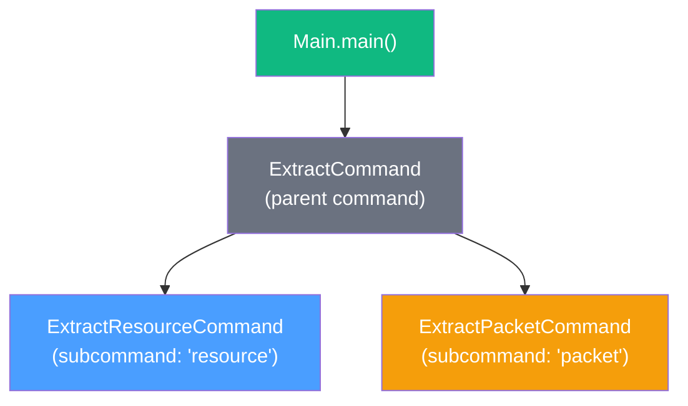
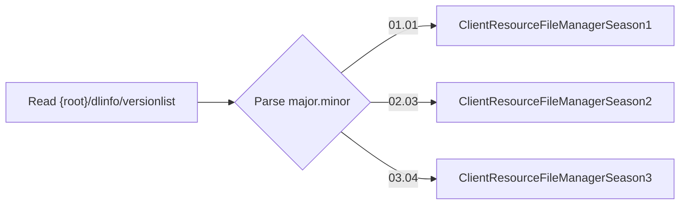
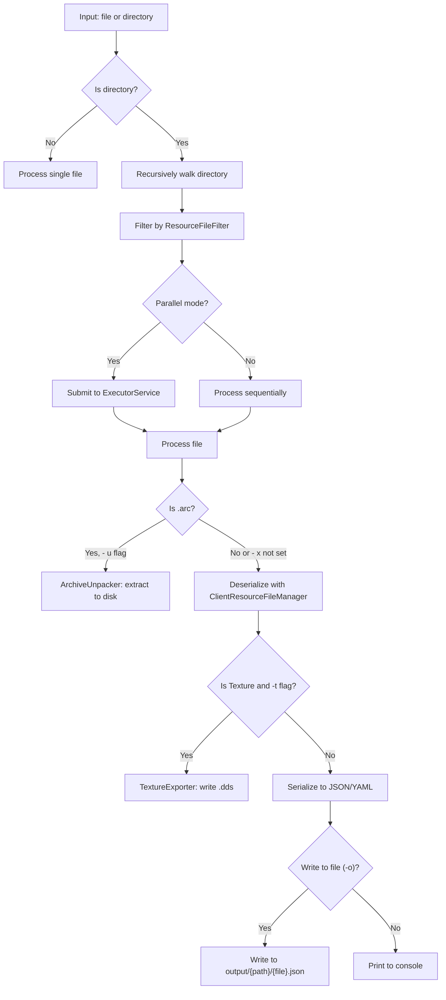
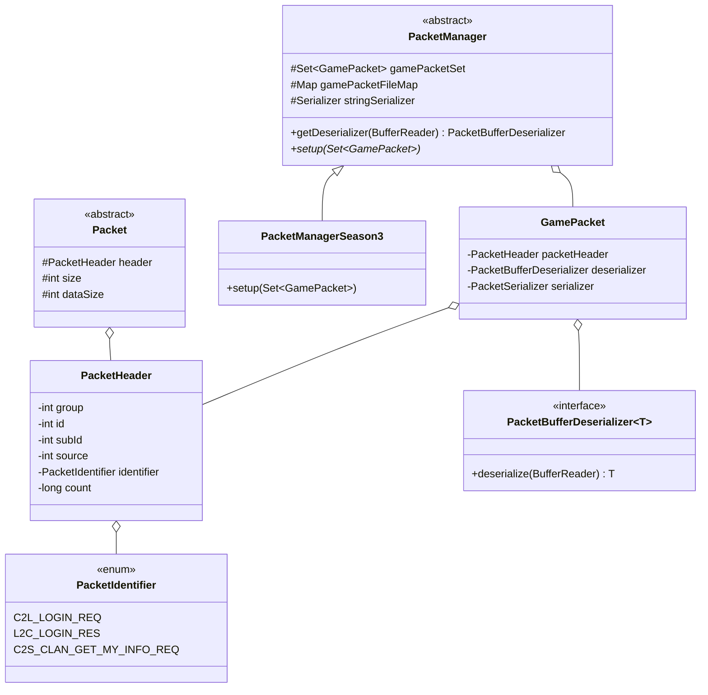

# CLI & Packet System

## CLI Architecture

The `cli` module is the user-facing entry point, built with [picocli](https://picocli.info/).

### Command Structure



- **`Main`** — creates a `CommandLine` instance and executes.
- **`ExtractCommand`** — parent command (`extract`), defines `--help` and `--version`. No logic, just routes to
  subcommands.
- **`ExtractResourceCommand`** — the primary subcommand (`resource`). Handles file/directory traversal, deserialization,
  and output.
- **`ExtractPacketCommand`** — secondary subcommand (`packet`). Handles network packet file deserialization (
  experimental).

### Resource Extraction Arguments

| Argument           | Flag                                  | Type                  | Default  | Description                                       |
|--------------------|---------------------------------------|-----------------------|----------|---------------------------------------------------|
| Client root folder | *(positional 0)*                      | `Path`                | required | DDON installation root (e.g., `D:\DDON_03040008`) |
| Translation file   | *(positional 1)*                      | `Path`                | required | GMD translation CSV file                          |
| Input path         | *(positional 2)*                      | `Path`                | required | File or directory to process                      |
| Output format      | `-f`, `--format`                      | `SerializationFormat` | `json`   | `json` or `yaml`                                  |
| Write to file      | `-o`                                  | `boolean`             | `false`  | Output to file instead of console                 |
| Meta information   | `-m`, `--meta-information`            | `boolean`             | `false`  | Enrich output with resolved names/translations    |
| Unpack archives    | `-u`, `--unpack-archives`             | `boolean`             | `false`  | Decompress and decrypt `.arc` files               |
| Archives only      | `-x`, `--unpack-archives-exclusively` | `boolean`             | `false`  | Only process `.arc` files, skip others            |
| Parallel           | `-p`, `--parallel`                    | `boolean`             | `true`   | Run file processing in parallel                   |
| Export textures    | `-t`, `--export-textures`             | `boolean`             | `false`  | Export `.tex` files as `.dds`                     |
| Ignore extensions  | `-i`, `--ignore-extensions`           | `Set<String>`         | empty    | Comma-separated extensions to skip                |

### Version Detection Flow



### File Processing Pipeline



### Utility Classes

| Class                | Purpose                                                                                                                       |
|----------------------|-------------------------------------------------------------------------------------------------------------------------------|
| `ArchiveUnpacker`    | Extracts files from deserialized `Archive` objects to disk, creating the directory structure.                                 |
| `FileChangeDetector` | Tracks file checksums to detect changes and avoid redundant reprocessing.                                                     |
| `ResourceFileFilter` | Filters files by supported extensions (`ClientResourceFileExtension.getSupportedFileExtensions()`), respects the ignore list. |
| `TextureExporter`    | Converts deserialized `Texture` objects to DDS format using `DirectDrawSurfaceSerializer` and writes them to disk.            |

### Native Packaging

The `cli` module's `build.gradle` configures JLink + jpackage:

```
jlink options: --strip-debug, --compress zip-6, --no-header-files, --no-man-pages
jpackage:      --win-console, skipInstaller = true
Application:   mainModule = org.sehkah.ddon.tools.extractor.cli
               mainClass  = org.sehkah.ddon.tools.extractor.cli.Main
```

This produces a self-contained executable (`ddon-extractor.exe` on Windows) with an embedded JRE — no system Java
installation required.

---

## Packet System

The packet system mirrors the resource deserialization architecture but operates on captured network traffic instead of
client files. It is **experimental** and currently only supports **Season 3** with **2 packet types**.

### Architecture



### Packet Naming Convention

DDON uses a directional naming convention:

| Prefix | Direction             | Meaning               |
|--------|-----------------------|-----------------------|
| `C2L`  | Client → Login Server | Login-phase packets   |
| `L2C`  | Login Server → Client | Login-phase responses |
| `C2S`  | Client → Game Server  | Gameplay packets      |
| `S2C`  | Game Server → Client  | Gameplay responses    |

### Registered Packets (Season 3)

| Identifier      | Group | ID | SubID | Source | Deserializer                    |
|-----------------|-------|----|-------|--------|---------------------------------|
| `C2L_LOGIN_REQ` | 0     | 1  | 1     | `0x00` | `C2LLoginReqBufferDeserializer` |
| `L2C_LOGIN_RES` | 0     | 1  | 2     | `0x34` | `L2CLoginResBufferDeserializer` |

### Packet vs. Resource Differences

| Aspect                     | Resources                     | Packets                                                                       |
|----------------------------|-------------------------------|-------------------------------------------------------------------------------|
| Byte order                 | **Little-endian**             | **Big-endian**                                                                |
| Header                     | Magic string + version        | Group + ID + SubID + source                                                   |
| Lookup key                 | `Pair<Extension, FileHeader>` | `PacketHeader`                                                                |
| Manager                    | `ClientResourceFileManager`   | `PacketManager`                                                               |
| Base class                 | `Resource`                    | `Packet`                                                                      |
| Season support             | All three                     | Season 3 only                                                                 |
| Deserializer instantiation | Direct constructor            | **Reflection** via `Class.getConstructor(GamePacket.class).newInstance(this)` |

### Packet Extraction Arguments

| Argument           | Flag                       | Type                  | Default  | Description               |
|--------------------|----------------------------|-----------------------|----------|---------------------------|
| Client root folder | *(positional 0)*           | `Path`                | required | DDON client resource path |
| Input path         | *(positional 1)*           | `Path`                | required | Packet file or directory  |
| Output format      | `-f`, `--format`           | `SerializationFormat` | `json`   | `json` or `yaml`          |
| Write to file      | `-o`                       | `boolean`             | `false`  | Output to file            |
| Meta information   | `-m`, `--meta-information` | `boolean`             | `false`  | Enrich output             |
| Parallel           | `-p`, `--parallel`         | `boolean`             | `true`   | Parallel processing       |

### MetaInformation on Packets

The `PacketHeader` class uses `@MetaInformation` annotations on enriched fields:

```java

@MetaInformation
private final PacketGroup packetGroup;      // resolved group name
@MetaInformation
private final PacketSubType packetSubType;  // resolved sub-type
@MetaInformation
private final PacketType packetType;        // resolved type name
@MetaInformation
private PacketIdentifier identifier;        // human-readable enum name
```

Similarly, `Packet.size` and `Packet.dataSize` are marked `@MetaInformation` as they are wire-level metadata not part of
the logical packet payload.
