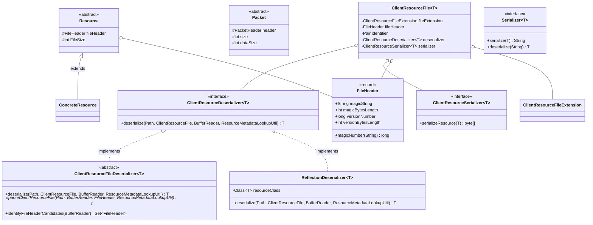
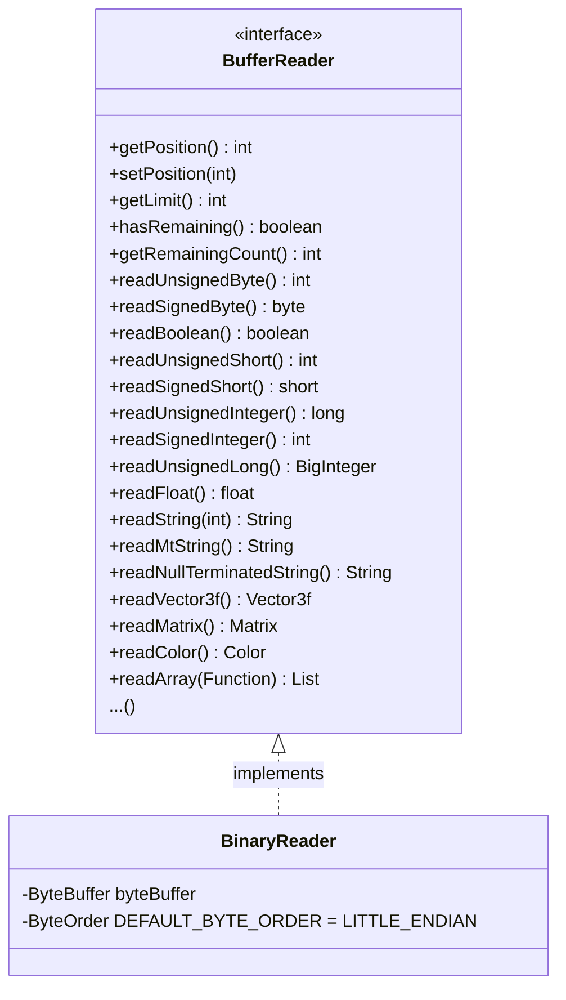
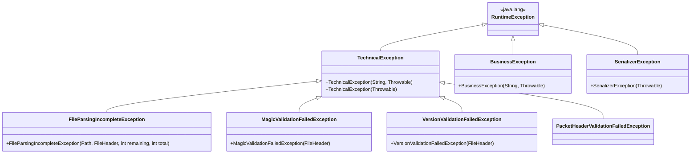

# Core Concepts

This document describes the foundational abstractions defined primarily in the `lib-api` module that all other modules
build upon.

## Class Hierarchy Overview



## Resource

```java
// lib-api: org.sehkah.ddon.tools.extractor.api.entity.Resource
@Data
@JsonTypeInfo(use = JsonTypeInfo.Id.CLASS, property = "@class")
public abstract class Resource {
    protected FileHeader fileHeader;
    protected int FileSize;
}
```

`Resource` is the **abstract base class** for every deserialized client file. Key design decisions:

- **`@JsonTypeInfo`**: Embeds the concrete class name as `@class` in JSON output, enabling polymorphic deserialization
  for round-trip support.
- **`@Data`** (Lombok): Generates getters, setters, `equals`, `hashCode`, and `toString`.
- **`fileHeader`**: Set after deserialization with the parsed magic string and version number.
- **`FileSize`**: Set to the total buffer size after successful deserialization.

All concrete resource entities (e.g., `EnemyGroupList`, `StageListInfoList`, `ItemList`) extend `Resource`.

## FileHeader

```java
// lib-api: org.sehkah.ddon.tools.extractor.api.entity.FileHeader
public record FileHeader(
                String magicString,
                int magicBytesLength,
                long versionNumber,
                int versionBytesLength
        ) { ...
}
```

A **record** encapsulating the identification bytes at the start of every DDON resource file:

| Field                | Purpose                                                          | Typical Values                          |
|----------------------|------------------------------------------------------------------|-----------------------------------------|
| `magicString`        | 3-4 character identifier (e.g., `"GMD\0"`, `"ARI\0"`, `"TEX\0"`) | `null` for files without a magic header |
| `magicBytesLength`   | Byte count consumed by the magic string                          | 0 or 4                                  |
| `versionNumber`      | Format version, changes across seasons                           | e.g., 66306 for `.gmd`, 7 for `.arc`    |
| `versionBytesLength` | Byte count consumed by the version                               | 2 or 4                                  |

The `FileHeader` serves as **half of the composite key** (together with `ClientResourceFileExtension`) used to look up
the correct deserializer.

### Constructors

- `FileHeader(String magic, int magicLen, long version, int versionLen)` — full constructor.
- `FileHeader(String magic, long version, int versionLen)` — infers `magicBytesLength` from `magicString.length()`.
- `FileHeader(long version, int versionLen)` — no magic string (some files have version-only headers).

## ClientResourceFile\<T\>

```java
// lib-api: org.sehkah.ddon.tools.extractor.api.logic.resource.ClientResourceFile
@Data
public class ClientResourceFile<T extends Resource> {
    private ClientResourceFileExtension fileExtension;
    private FileHeader fileHeader;
    private Pair<ClientResourceFileExtension, FileHeader> identifier;
    private ClientResourceDeserializer<T> deserializer;
    private ClientResourceSerializer<T> serializer;  // optional, null for most types
}
```

The **binding object** that associates a file extension + header combination with its deserializer (and optionally a
serializer). This is the value type stored in the `ClientResourceFileManager`'s lookup map.

## BufferReader / BinaryReader



`BufferReader` is the **core I/O abstraction** — an interface for reading typed values from a byte buffer. It supports:

- **Primitive types**: `u8`, `s8`, `u16`, `s16`, `u32`, `s32`, `u64`, `f32`, `bool`
- **Strings**: fixed-length, null-terminated, `MtString` (length-prefixed, MT Framework convention), Japanese-encoded
- **Composite types**: `Vector3f`, `Vector4f`, `Matrix`, `Sphere`, `Cylinder`, `Rectangle`, `Color`, `Color4l`,
  `AxisAlignedBoundingBox`, `OrientedBoundingBox`, `Float2f`, `HermiteCurve`
- **Array reading**: `readArray(Function)` reads a `u32` count followed by that many elements;
  `readFixedLengthArray(int, Function)` reads a known count.

`BinaryReader` wraps a `ByteBuffer` in **little-endian** byte order (the DDON client's native format). It can be
constructed from a `Path` (file) or a `byte[]` array.

## BufferWriter / BinaryWriter

The write-side mirror of `BufferReader`:

- `BufferWriter` — interface with `writeUnsignedByte`, `writeUnsignedInteger`, `writeString`, `writeVector3f`,
  `writeArray`, etc.
- `BinaryWriter` — `ByteBuffer`-backed implementation, little-endian.

Used by the proof-of-concept binary serializers (see [Serialization](serialization.md)).

## Custom Data Types

Defined in `org.sehkah.ddon.tools.extractor.api.datatype`:

| Type                     | Fields                             | Usage                   |
|--------------------------|------------------------------------|-------------------------|
| `Vector2f`               | `x`, `y`                           | 2D positions            |
| `Vector3f`               | `x`, `y`, `z`                      | 3D positions, normals   |
| `Vector4f`               | `x`, `y`, `z`, `w`                 | Quaternions, 4D vectors |
| `Matrix`                 | 4×4 `float` matrix                 | Transforms              |
| `Sphere`                 | `Vector3f` center + `float` radius | Bounding volumes        |
| `Cylinder`               | position + radius + height         | Collision volumes       |
| `Rectangle`              | min/max coordinates                | UI regions              |
| `Color`                  | `r`, `g`, `b`, `a`                 | Standard color          |
| `Color4l`                | `r`, `g`, `b`, `a` (long)          | Extended color          |
| `Float2f`                | two floats                         | UV coordinates          |
| `AxisAlignedBoundingBox` | min + max `Vector3f`               | AABB                    |
| `OrientedBoundingBox`    | center + extents + rotation        | OBB                     |
| `HermiteCurve`           | control points                     | Animation curves        |

These types are read/written atomically by `BufferReader` / `BufferWriter` methods and serialize to nested JSON objects.

## Deserialization Interface Hierarchy

### ClientResourceDeserializer\<T\> (Interface)

```java
public interface ClientResourceDeserializer<T extends Resource> {
    T deserialize(Path filePath, ClientResourceFile<T> clientResourceFile,
                  BufferReader bufferReader, ResourceMetadataLookupUtil lookupUtil);
}
```

The top-level contract. Takes a buffer and returns a typed `Resource`.

### ClientResourceFileDeserializer\<T\> (Abstract Class — Template Method Pattern)

The **workhorse base class** used by >95% of all deserializers:

1. **Parses the file header** via `FileHeaderDeserializer.parseClientResourceFileUnsafe()`.
2. **Delegates** to the abstract `parseClientResourceFile()` template method.
3. **Validates** that no bytes remain unread (`hasRemaining()` → throws `FileParsingIncompleteException`).
4. **Sets** `fileSize` and `fileHeader` on the result.

Subclasses only need to implement `parseClientResourceFile(Path, BufferReader, FileHeader, ResourceMetadataLookupUtil)`.

#### Header Candidate Identification

The static method `identifyFileHeaderCandidates(BufferReader)` tries **four strategies** to identify the file header
without knowing the format in advance:

| # | Strategy                        | Magic         | Version |
|---|---------------------------------|---------------|---------|
| 1 | `magic(4 bytes) + version(u16)` | 4-char string | 2 bytes |
| 2 | `magic(4 bytes) + version(u32)` | 4-char string | 4 bytes |
| 3 | `version(u32)` only             | none          | 4 bytes |
| 4 | `version(u16)` only             | none          | 2 bytes |

These candidates are tried against the lookup map until a match is found.

### ReflectionDeserializer\<T\> (Experimental)

An **annotation-driven** deserializer that reads fields automatically based on `@DataType` and `@ArrayDataType`
annotations on entity class fields:

```java

@DataType(size = DDONPrimitiveDataType.u32)
private long someId;

@ArrayDataType(size = DDONPrimitiveDataType.u32)
private List<SubEntity> entries;
```

Supported primitive types in `DDONPrimitiveDataType`: `u8`, `u16`, `u32`, `u64`, `s8`, `s16`, `s32`, `f32`, `bool`,
`vector3f`.

This is **experimental** and used for a small number of resource types. The long-term goal is to replace most
hand-crafted deserializers with this approach.

## Serialization Interfaces

### Serializer\<T\> (Text Output)

```java
public interface Serializer<T> {
    String serialize(T deserialized) throws SerializerException;

    T deserialize(String serialized);
}
```

Converts `Resource` or `Packet` objects to/from JSON or YAML strings. Implemented by `ClientStringSerializer` (for
resources) and `PacketStringSerializer` (for packets), both backed by Jackson `ObjectMapper`.

### ClientResourceSerializer\<T\> (Binary Output)

```java
public interface ClientResourceSerializer<T extends Resource> {
    byte[] serializeResource(T deserialized) throws SerializerException;
}
```

Converts a deserialized `Resource` object back to its **original binary format**. Only 4 implementations exist as proof
of concept.

### MetaInformation Annotation

```java

@Target({ElementType.METHOD, ElementType.FIELD})
@Retention(RetentionPolicy.RUNTIME)
public @interface MetaInformation {
}
```

Fields annotated with `@MetaInformation` contain **enriched/derived data** (e.g., resolved NPC names, translated quest
text) that are not part of the original binary format. When the user passes `-m` / `--meta-information` on the CLI,
these fields are included in the output. Otherwise, `MetaInformationIntrospector` (a Jackson
`JacksonAnnotationIntrospector` subclass) **suppresses** them.

## Error Hierarchy



| Exception                               | When Thrown                                                                                                      |
|-----------------------------------------|------------------------------------------------------------------------------------------------------------------|
| `TechnicalException`                    | General infrastructure failures (I/O, reflection, config).                                                       |
| `FileParsingIncompleteException`        | Deserializer finished but bytes remain in the buffer — indicates a format mismatch or incomplete implementation. |
| `MagicValidationFailedException`        | Parsed magic string doesn't match the expected value.                                                            |
| `VersionValidationFailedException`      | Parsed version number doesn't match the expected value.                                                          |
| `SerializerException`                   | Jackson serialization/deserialization failure.                                                                   |
| `BusinessException`                     | Domain-level errors (rare).                                                                                      |
| `PacketHeaderValidationFailedException` | Packet header fields don't match expected values.                                                                |

## ClientResourceFileExtension Enum

A large enum (~200 values) mapping each supported resource type to a symbolic name:

```java
public enum ClientResourceFileExtension {
    DirectDrawSurface,
    rAbilityAddData,
    rAbilityData,
    rAbilityList,
    rAchievement,
    // ... ~200 entries
    rWepCateResTbl;
}
```

See [Extension Mapping](extension-mapping.md) for the full table.
