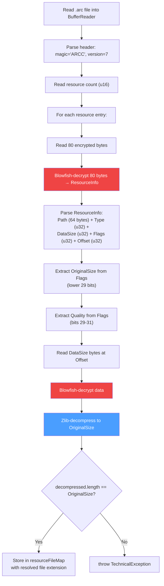
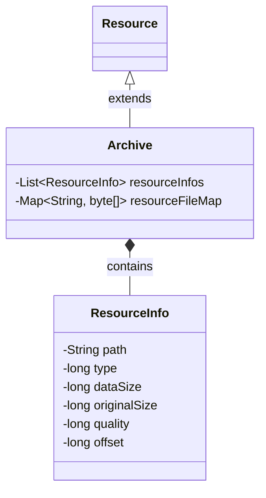

# Crypto & Archives

DDON packages a majority of its client resources inside `.arc` (archive) files. The project supports two archive
variants, one of which requires Blowfish decryption and zlib decompression.

## Archive Formats

| Magic  | Format            | Deserializer                   | Description                                                       |
|--------|-------------------|--------------------------------|-------------------------------------------------------------------|
| `ARCC` | Encrypted archive | `EncryptedArchiveDeserializer` | Resources are individually Blowfish-encrypted and zlib-compressed |
| `ARCS` | Reference archive | `ReferenceArchiveDeserializer` | Resources are referenced via IDs                                  |

Both share:

- **Version**: 7
- **Version byte length**: 2 (u16)
- **Extension**: `.arc`
- **Enum**: `ClientResourceFileExtension.rArchive`

They are distinguished by the magic string and registered as two separate entries in `addCommonResourceMapping()`:

```java
new ClientResourceFile<>(rArchive,new

FileHeader("ARCC",7,2), new

EncryptedArchiveDeserializer());
        new ClientResourceFile<>(rArchive,new

FileHeader("ARCS",7,2), new

ReferenceArchiveDeserializer());
```

## Encrypted Archive Pipeline (ARCC)



### ResourceInfo Structure

Each resource entry is described by an 80-byte **encrypted** header:

| Field      | Offset | Size          | Description                                                  |
|------------|--------|---------------|--------------------------------------------------------------|
| `Path`     | 0      | 64 bytes      | Null-terminated string, internal archive path                |
| `Type`     | 64     | 4 bytes (u32) | JamCRC hash of the resource type name                        |
| `DataSize` | 68     | 4 bytes (u32) | Size of the compressed+encrypted data blob                   |
| `Flags`    | 72     | 4 bytes (u32) | Bitfield: `OriginalSize` (bits 0-28), `Quality` (bits 29-31) |
| `Offset`   | 76     | 4 bytes (u32) | Offset to the data blob (from a base of `0x8000`)            |

### File Extension Resolution

The `Type` field is a JamCRC hash. To determine the file extension:

```java
String typeName = FrameworkResourcesUtil.getFrameworkResourceClassNameByCrc(resourceInfo.getType());
String extension = FrameworkResourcesUtil.getFileExtension(typeName);
// e.g., Type=0x242BB29A → "rGUIMessage" → ".gmd"
```

## Crypto Utilities

### Blowfish (BlowFishUtil / BlowFishCompat)

Located in `org.sehkah.ddon.tools.extractor.api.crypto`:

| Class            | Purpose                                                                   |
|------------------|---------------------------------------------------------------------------|
| `BlowFishUtil`   | Static `decrypt(byte[])` method using a hardcoded key.                    |
| `BlowFishCompat` | BouncyCastle-based Blowfish implementation. Handles padding and ECB mode. |

The Blowfish key is compiled into the application (derived from the game client's known encryption key).

### Zlib (ZipUtil)

```java
public class ZipUtil {
    public static byte[] decompress(byte[] data, int originalSize) { ...}
}
```

Uses `java.util.zip.Inflater` to decompress zlib-compressed data. The `originalSize` parameter is used to allocate the
output buffer and verify the decompressed result.

### JamCRC (CrcUtil)

```java
public class CrcUtil {
    public static long jamCrc(String input) { ...}
}
```

Computes the **JamCRC** hash (a variant of CRC32 with inverted final XOR) used by the MT Framework engine to identify
resource types. This is used by:

- `FrameworkResourcesUtil` to build the JamCRC → class name lookup table at startup.
- `ClientResourceFileExtension` to map enum values to their JamCRC identifiers.

## Archive Entity Structure



The deserialized `Archive` object contains:

1. **`resourceInfos`** — metadata about each packed file.
2. **`resourceFileMap`** — the actual decompressed/decrypted file contents keyed by their full path (including resolved
   extension).

## Archive Unpacking (CLI)

The CLI's `ArchiveUnpacker` utility handles writing the archive contents to disk:

1. Deserializes the `.arc` file using the appropriate archive deserializer.
2. Iterates over `resourceFileMap` entries.
3. Creates the directory structure mirroring the archive's internal paths.
4. Writes each file's raw bytes to disk.
5. Generates a descriptive metadata file for the archive.

This is triggered by the `-u` (`--unpack-archives`) flag. When combined with `-x` (`--unpack-archives-exclusively`),
only `.arc` files are processed and all other file types are skipped.
