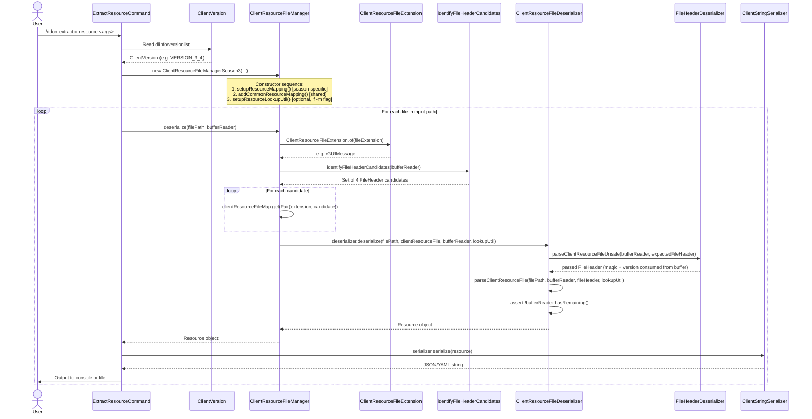
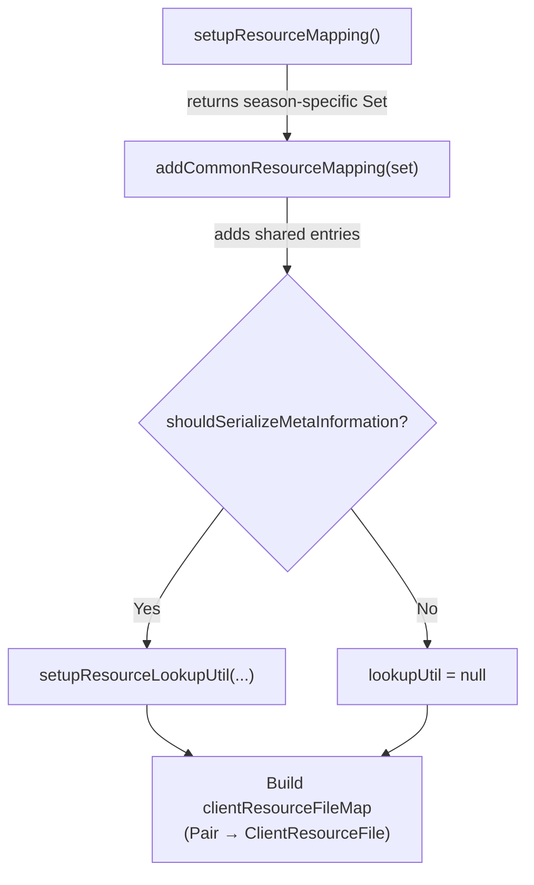
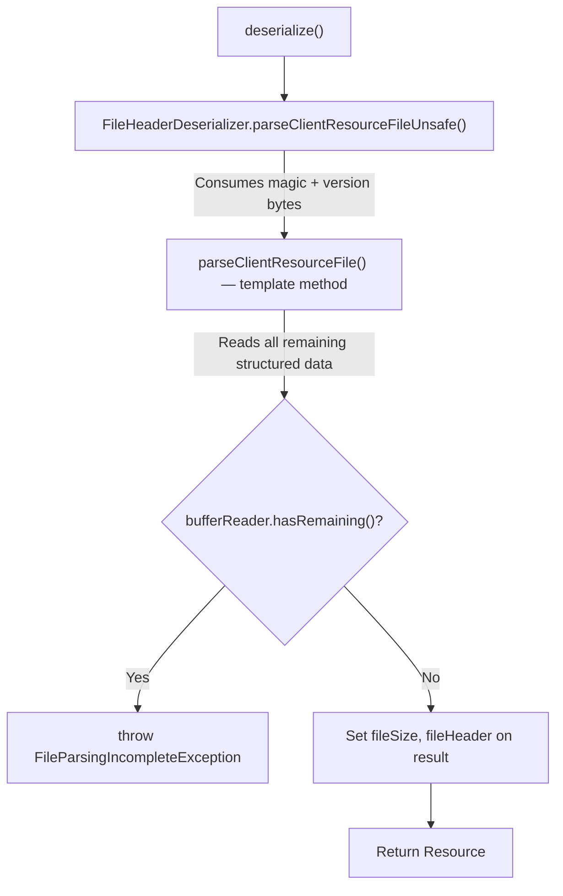

# Deserialization Flow

This document traces the flow of a file being deserialized by `ddon-extractor`, from the CLI command through to the
final JSON output.

## End-to-End Sequence



## Step-by-Step Details

### 1. Version Detection

The CLI reads the file `{clientRootFolder}/dlinfo/versionlist` to determine the client version:

```java
ClientVersion clientVersion = ClientVersion.of(
        Integer.parseInt(versionlistString.substring(0, 2)),  // major
        Integer.parseInt(versionlistString.substring(2, 4))   // minor
);
```

| Version String | `ClientVersion` Enum | Manager Class                      |
|----------------|----------------------|------------------------------------|
| `0101...`      | `VERSION_1_1`        | `ClientResourceFileManagerSeason1` |
| `0203...`      | `VERSION_2_3`        | `ClientResourceFileManagerSeason2` |
| `0304...`      | `VERSION_3_4`        | `ClientResourceFileManagerSeason3` |

### 2. Manager Initialization

The `ClientResourceFileManager` constructor executes in strict order:



- **`setupResourceMapping()`** — overridden by each season subclass, returns ~40-100 season-specific
  `ClientResourceFile` entries.
- **`addCommonResourceMapping()`** — adds ~90 shared entries (defined in `ClientResourceFileManager` base class).
- **`setupResourceLookupUtil()`** — optionally initializes the `ResourceMetadataLookupUtil` which pre-loads translation
  CSVs, NPC ledgers, item lists, stage lists, and enemy groups for enriching output with human-readable names.

### 3. File Extension Lookup

Given a file path like `game_common/param/enemy_group.emg`:

1. Extract the extension string: `".emg"`
2. Look up in the static `ClientResourceFileExtension.fileExtensionToResourceMap`:
    - `.emg` → `rEnemyGroup`

The map contains ~150 entries including:

- Standard extensions: `.gmd`, `.arc`, `.tex`, `.dds`, `.slt`, `.ari`, ...
- JamCRC hex fallbacks: `.2EA55F30` → `rPlayerExpTable` (for files where the extension was not determinable by the ARC
  unpacker)

### 4. Header Candidate Identification

Since the exact header format isn't known until a match is found, `identifyFileHeaderCandidates()` reads the first bytes
**non-destructively** (resetting the buffer position each time) and produces four candidate `FileHeader` objects:

```
Buffer contents: [47 4D 44 00] [02 03 01 00] ...
                  "GMD\0"       66306 (u32 LE)
```

| Priority    | Candidate                 | Magic     | Version            |
|-------------|---------------------------|-----------|--------------------|
| 1 (highest) | `magic(4) + version(u16)` | `"GMD\0"` | 0x0302 = 770       | 
| 2           | `magic(4) + version(u32)` | `"GMD\0"` | 0x00010302 = 66306 | ← **match!**
| 3           | `version(u32)` only       | *(none)*  | 0x00444D47         |
| 4 (lowest)  | `version(u16)` only       | *(none)*  | 0x4D47             |

Each candidate is checked against the `clientResourceFileMap` using `Pair.of(extension, candidate)` as the key. The
first match wins.

### 5. Deserialization

Once a matching `ClientResourceFile` is found, its `deserializer.deserialize()` is called. For the vast majority of
deserializers (those extending `ClientResourceFileDeserializer`):



The `parseClientResourceFile()` template method is where each concrete deserializer reads the actual data fields using
`BufferReader` methods:

```java
// Example: EmScaleTableDeserializer
@Override
protected EmScaleTable parseClientResourceFile(Path filePath, BufferReader bufferReader,
                                               FileHeader fileHeader, ResourceMetadataLookupUtil lookupUtil) {
    return new EmScaleTable(bufferReader.readArray(EmScaleTableDeserializer::readEmScaleData));
}

private static EmScale readEmScaleData(BufferReader bufferReader) {
    return new EmScale(
            bufferReader.readUnsignedInteger(),
            bufferReader.readFloat(),
            bufferReader.readVector3f()
    );
}
```

### 6. Metadata Enrichment (Optional)

When the user passes `-m` / `--meta-information`, the `ResourceMetadataLookupUtil` is non-null and available to
deserializers. It provides semantic resolution methods:

| Method                                  | What it resolves                                             |
|-----------------------------------------|--------------------------------------------------------------|
| `getNpcName(npcId)`                     | NPC ID → Japanese/English name (from NPC ledger + GMD files) |
| `getItemName(itemId)`                   | Item ID → name (from item list + GMD files)                  |
| `getEnemyName(enemyId)`                 | Enemy ID → name (from GMD enemy_name.gmd)                    |
| `getQuestName(questId)`                 | Quest ID → name (from per-quest GMD files)                   |
| `getStageName*(stageNo/Id)`             | Stage number → area name                                     |
| `getSkillName(jobId, skillNo)`          | Job + skill number → skill name                              |
| `getJobName(jobId)`                     | Job ID → job name                                            |
| `getSpotName(spotId)`                   | Map spot → spot name                                         |
| `getMessageTranslation(gmdPath, index)` | GMD file + index → JP/EN translation pair                    |

These resolved values are stored in fields annotated with `@MetaInformation` on the entity classes. The
`MetaInformationIntrospector` controls whether these fields appear in the JSON output.

### Resource Cache

The `ResourceCache` class (backed by `ConcurrentHashMap`) **lazily loads and caches** resource files needed for metadata
resolution. This prevents redundant parsing of commonly referenced files like `npc.nll`, `enemy_group.emg`,
`stage_list.slt`, and `itemlist.ipa`.


### 7. Serialization to Text

The deserialized `Resource` is passed through the `ClientStringSerializer` (a `Serializer<Resource>` implementation):

- Uses Jackson `ObjectMapper` configured with:
    - `UPPER_CAMEL_CASE` property naming
    - `INDENT_OUTPUT` for readability
    - `NON_NULL` inclusion (null fields omitted)
    - `SORT_PROPERTIES_ALPHABETICALLY`
    - Optional `MetaInformationIntrospector` to filter `@MetaInformation` fields

Supported formats:

- **JSON** (`JsonMapper`)
- **YAML** (`YAMLMapper`)

### 8. Output

The serialized string is either:

- **Printed to console** (default)
- **Written to a file** (`-o` flag) at `output/{relative-path}/{filename}.{format}`

## Concrete Example: `enemy_group.emg`

```
Input:  game_common/param/enemy_group.emg (binary)
Output: enemy_group.emg.json

1. Extension: ".emg" → ClientResourceFileExtension.rEnemyGroup
2. Header candidates tried:
   - Pair(rEnemyGroup, FileHeader(null, 0, 1, 4)) → MATCH
     (no magic string, version = 1, 4-byte version)
3. Deserializer: EnemyGroupDeserializer
4. Parsed header: version = 1 (consumed 4 bytes)
5. parseClientResourceFile() reads array of EnemyGroup records
6. Optional: lookupUtil enriches enemy names via enemy_name.gmd
7. Serialized to JSON with Jackson
8. Written to output/game_common/param/enemy_group.emg.json
```
