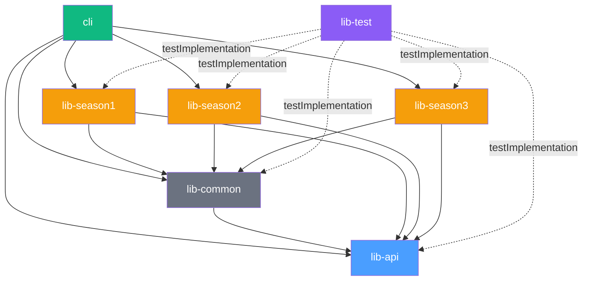

# Architecture Overview

## Project Purpose

`ddon-extractor` reverse-engineers the proprietary binary file formats used by the Dragon's Dogma Online (DDON) game
client. The primary output is a JSON (or YAML) representation of each file's structured data. The project also includes
support for:

- **Binary serialization** (round-trip: binary → JSON → binary) for a handful of resource types.
- **Network packet deserialization** for captured game traffic (Season 3 only).
- **Archive unpacking** including Blowfish-encrypted `.arc` files.

The main source of knowledge for understanding the file formats comes from the **debug symbols of the PS4 client**,
recorded in the separate `ddon-data` repository.

## Module Structure

The project is a **multi-module Gradle build** with seven subprojects:

```
ddon-extractor/                (root — build orchestration only)
├── lib-api/                   (core interfaces, data types, I/O, crypto)
├── lib-common/                (shared deserializers & manager base class)
├── lib-season1/               (Season 1 specific deserializers & entities)
├── lib-season2/               (Season 2 specific deserializers & entities)
├── lib-season3/               (Season 3 specific deserializers, entities & packets)
├── cli/                       (picocli command-line application)
└── lib-test/                  (cross-module integration tests)
```

### Publishable vs. Non-Publishable

| Category                | Modules                                                              | Notes                                                                              |
|-------------------------|----------------------------------------------------------------------|------------------------------------------------------------------------------------|
| **Publishable** (Maven) | `lib-api`, `lib-common`, `lib-season1`, `lib-season2`, `lib-season3` | Published with `maven-publish` plugin, artifact IDs like `ddon-extractor-lib-api`. |
| **Non-publishable**     | `cli`, `lib-test`                                                    | `cli` produces a native executable via JLink/jpackage. `lib-test` is test-only.    |

## Module Dependency Graph



> **Note:** Every season module depends on both `lib-api` (interfaces) and `lib-common` (shared deserialization logic).
> The CLI depends on all five library modules. The test module uses `testImplementation` dependencies to access all
> modules without being part of the production dependency chain.

## Build System

### Gradle Configuration

| Aspect                    | Detail                                                                                                                  |
|---------------------------|-------------------------------------------------------------------------------------------------------------------------|
| **JDK**                   | **JDK 25** (Eclipse Adoptium). Configured via `java.toolchain.languageVersion`.                                         |
| **Module system**         | Full **JPMS** (Java Platform Module System). Each module has a `module-info.java`. `modularity.inferModulePath = true`. |
| **Annotation processing** | [Lombok](https://projectlombok.org/) via `io.freefair.lombok` plugin.                                                   |
| **Dependency versions**   | Centralized in `settings.gradle` using Gradle **version catalogs** (`common`, `log`, `lib`, `libTest`, `cli`).          |
| **Native packaging**      | [Badass JLink Plugin](https://badass-jlink-plugin.beryx.org/) `jlink` + `jpackage` in the `cli` module.                 |
| **Benchmarks**            | [JMH Gradle Plugin](https://github.com/melix/jmh-gradle-plugin) in `lib-api` and `cli`.                                 |
| **Code coverage**         | Jacoco (applied to all subprojects).                                                                                    |
| **Dependency updates**    | `com.github.ben-manes.versions`.                                                                                        |

### Key Dependencies

| Library                             | Usage                                            |
|-------------------------------------|--------------------------------------------------|
| Jackson (core, databind, YAML, CSV) | JSON/YAML serialization, CSV translation loading |
| BouncyCastle (`bcprov-jdk18on`)     | Blowfish decryption of encrypted archives        |
| Apache Commons Lang3                | `Pair`, `StringUtils` utilities                  |
| SLF4J + Log4j2                      | Logging                                          |
| picocli                             | CLI argument parsing (cli module only)           |
| JUnit Jupiter                       | Testing                                          |
| Mockito                             | Test mocking                                     |

## JPMS Module Names

| Gradle Module | JPMS Module Name                                |
|---------------|-------------------------------------------------|
| `lib-api`     | `org.sehkah.ddon.tools.extractor.lib.api`       |
| `lib-common`  | `org.sehkah.ddon.tools.extractor.lib.common`    |
| `lib-season1` | `org.sehkah.ddon.tools.extractor.lib.season1`   |
| `lib-season2` | `org.sehkah.ddon.tools.extractor.lib.season2`   |
| `lib-season3` | `org.sehkah.ddon.tools.extractor.lib.season3`   |
| `cli`         | `org.sehkah.ddon.tools.extractor.cli`           |
| `lib-test`    | *(classpath-based test module, no module-info)* |

## Package Naming Convention

All production packages follow the pattern:

```
org.sehkah.ddon.tools.extractor.{scope}.logic.{domain}.{layer}.{subdomain}
```

Where:

- **`{scope}`**: `api` | `common` | `season1` | `season2` | `season3` | `cli`
- **`{domain}`**: `resource` | `packet`
- **`{layer}`**: `deserialization` | `serialization` | `entity`
- **`{subdomain}`**: Game domain like `EM`, `game_common`, `stage`, `quest`, `gui_cmn`, `npc_common`, `skill`,
  `texture`, `binary`, etc.

Example: `org.sehkah.ddon.tools.extractor.season3.logic.resource.deserialization.stage`
