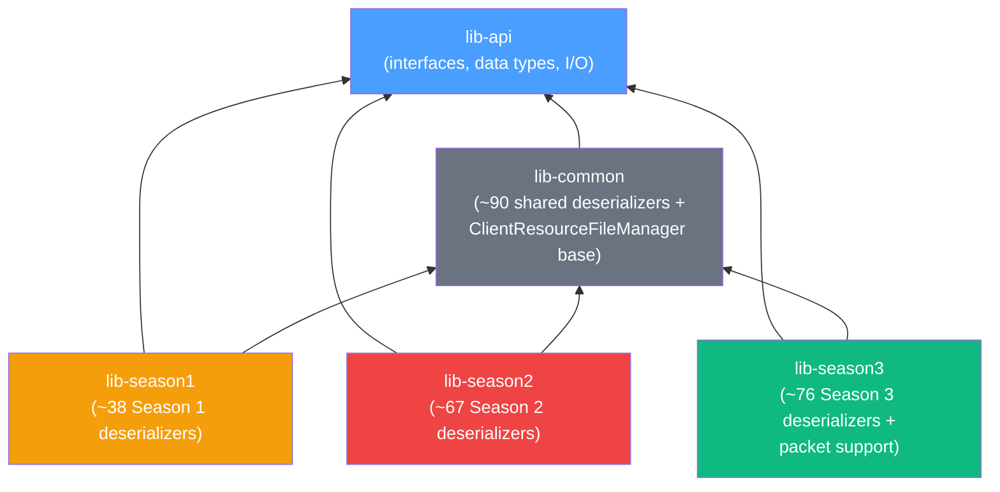
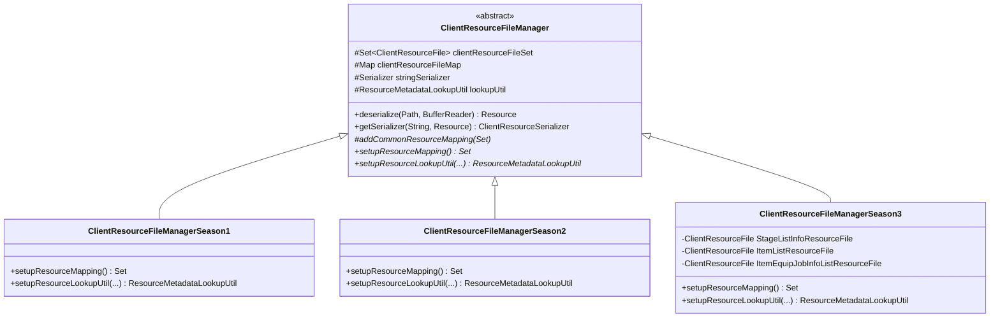
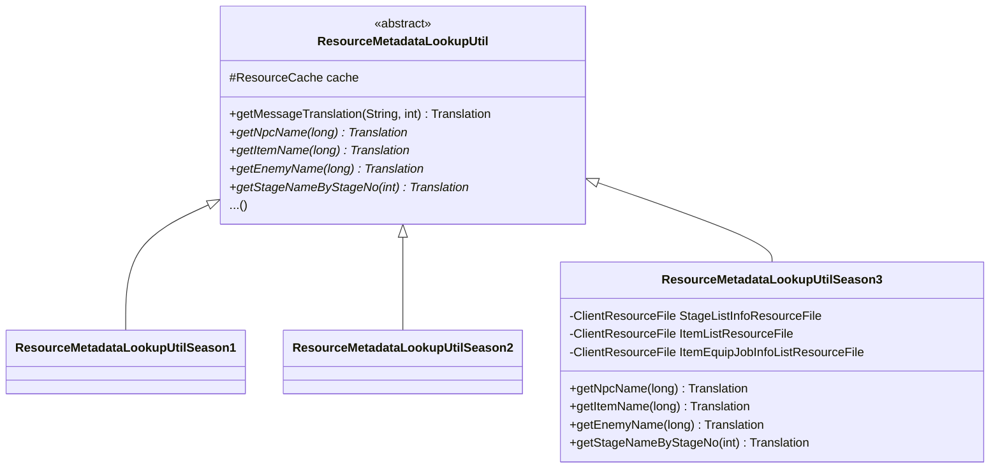

# Season Handling

## Background

Dragon's Dogma Online evolved through **three major seasons**, each introducing changes to file formats. Some changes
were additive (new fields appended), while others were breaking (field reordering, type changes, entirely new file
types). The project's architecture must handle all three seasons simultaneously.

| Season   | Client Version | `ClientVersion` Enum | Period                        |
|----------|----------------|----------------------|-------------------------------|
| Season 1 | `01.01`        | `VERSION_1_1`        | Launch – mid-lifecycle        |
| Season 2 | `02.03`        | `VERSION_2_3`        | Mid-lifecycle expansion       |
| Season 3 | `03.04`        | `VERSION_3_4`        | Final version (most complete) |

## Layered Architecture



### Layer Responsibilities

| Layer                   | Responsibility                                                                                                                                                                                                                                   |
|-------------------------|--------------------------------------------------------------------------------------------------------------------------------------------------------------------------------------------------------------------------------------------------|
| **`lib-api`**           | Pure interfaces, records, enums, and utility classes. No deserialization logic. Season-agnostic.                                                                                                                                                 |
| **`lib-common`**        | Contains **deserializers for file types whose binary format is identical across all three seasons**. Also defines the `ClientResourceFileManager` abstract base class and the common resource registration logic (`addCommonResourceMapping()`). |
| **`lib-season{1,2,3}`** | Contains **deserializers for file types that differ between seasons**. Each module provides a `ClientResourceFileManagerSeason{N}` subclass that registers the season-specific deserializers in `setupResourceMapping()`.                        |

## Manager Inheritance



### Constructor Flow

When a `ClientResourceFileManagerSeason3` is instantiated:

1. **`setupResourceMapping()`** is called first → returns ~100 Season 3-specific `ClientResourceFile` entries.
2. **`addCommonResourceMapping(set)`** adds ~90 shared entries to the same set (defined in the base class).
3. If meta-information is requested, **`setupResourceLookupUtil()`** creates a `ResourceMetadataLookupUtilSeason3` with
   season-specific item/stage/NPC lookup logic.
4. The combined set is indexed into `clientResourceFileMap` (keyed by `Pair<Extension, FileHeader>`).

This means the **common mappings and season-specific mappings coexist** in a single flat map. There is no override
mechanism — if a season needs a different version number for the same file type, it registers a different `FileHeader`.

## How Season Differences Manifest

### Same Extension, Different Deserializer

Many file types exist across all three seasons but with **different binary layouts**. Each season module provides its
own deserializer class:

| Resource          | Extension | S1 Deserializer                        | S2 Deserializer                        | S3 Deserializer                  | Difference                                                        |
|-------------------|-----------|----------------------------------------|----------------------------------------|----------------------------------|-------------------------------------------------------------------|
| `rAreaInfo`       | `.ari`    | `season1...AreaInfoDeserializer`       | `season2...AreaInfoDeserializer`       | `season3...AreaInfoDeserializer` | Fields added/changed per season                                   |
| `rItemList`       | `.ipa`    | `season1...ItemListDeserializer`       | `season2...ItemListDeserializer`       | `season3...ItemListDeserializer` | New item fields in later seasons and structure completely changed |
| `rPlayerExpTable` | `.exp`    | `season1...PlayerExpTableDeserializer` | `season2...PlayerExpTableDeserializer` | *(removed)*                      | S3 no longer provides a table as file                             |

### Season-Exclusive Resource Types

Some resource types only exist in certain seasons:

| Resource             | Extension | S1 | S2 | S3 | Notes                            |
|----------------------|-----------|----|----|----|----------------------------------|
| `rFurnitureData`     | `.fnd`    | ❌  | ✅  | ✅  | Clan housing added in S2         |
| `rFurnitureGroup`    | `.fng`    | ❌  | ✅  | ✅  | Clan housing added in S2         |
| `rEnhancedParamList` | `.epl`    | ❌  | ❌  | ✅  | S3-exclusive enhanced parameters |
| `rJukeBoxItem`       | `.jbi`    | ❌  | ❌  | ✅  | S3-exclusive jukebox             |
| `rPlanetariumItem`   | `.planet` | ❌  | ❌  | ✅  | S3-exclusive planetarium         |

### Common Resources (Season-Independent)

Resources registered in `addCommonResourceMapping()` have **identical binary formats across all seasons**. Examples:

| Resource               | Extension | Magic    | Version    | Notes                                 |
|------------------------|-----------|----------|------------|---------------------------------------|
| `rGUIMessage`          | `.gmd`    | `GMD\0`  | 66306      | Message data — same format throughout |
| `rArchive` (encrypted) | `.arc`    | `ARCC`   | 7          | Encrypted archive format              |
| `rArchive` (reference) | `.arc`    | `ARCS`   | 7          | Reference archive format              |
| `rTexture`             | `.tex`    | `TEX\0`  | 8349/41117 | Texture container                     |
| `rEnemyGroup`          | `.emg`    | *(none)* | 1          | Enemy group definitions               |
| `rRageTable`           | `.rag`    | *(none)* | 257        | Enemy rage tables                     |

## Entity Class Mirroring

Each deserializer has a corresponding **entity class** (or set of classes) in the same module. The entity package
structure mirrors the deserializer package structure:

```
lib-season3/src/main/java/org/sehkah/ddon/tools/extractor/season3/logic/resource/
├── deserialization/
│   └── stage/
│       ├── StageInfoDeserializer.java
│       └── StageJointDeserializer.java
└── entity/
    └── stage/
        ├── StageInfo.java
        └── StageJoint.java
```

Entity classes are typically **records** or **`@Data` classes** (via Lombok). Top-level entities extend `Resource`;
nested sub-entities are plain records/classes.

## ResourceMetadataLookupUtil — Season Subclasses

Each season module provides a `ResourceMetadataLookupUtil` subclass with season-specific lookup logic:



Season 3's lookup util, for example, has access to `ItemList`, `StageListInfoList`, and `ItemEquipJobInfoList` which are
used to resolve item names, stage names, and equipment job mappings.
