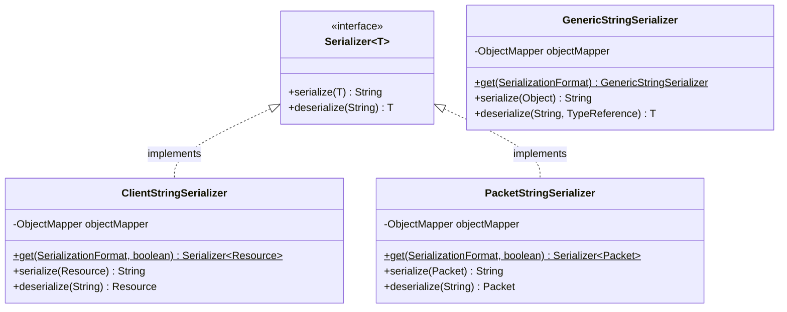
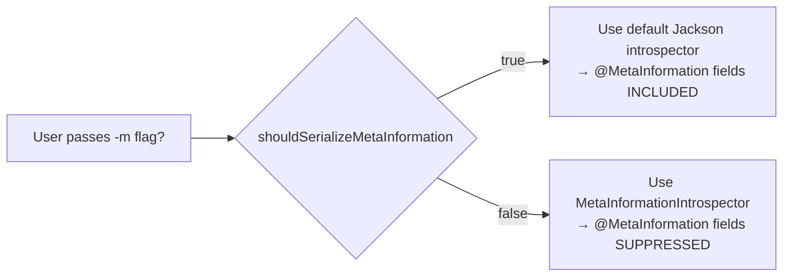
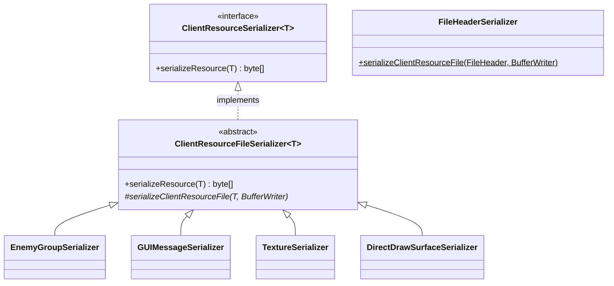
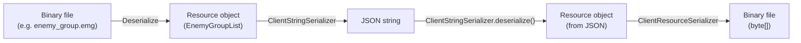

# Serialization

Serialization in `ddon-extractor` operates on **two dimensions**:

1. **Text serialization** — converting deserialized `Resource` / `Packet` objects to JSON or YAML strings for human
   consumption.
2. **Binary serialization** — converting `Resource` objects back to their original binary format.

## Text Serialization

### Architecture



### Jackson Configuration

All three serializer classes use Jackson `ObjectMapper` with consistent settings:

| Setting                              | Value              | Purpose                                                |
|--------------------------------------|--------------------|--------------------------------------------------------|
| `INDENT_OUTPUT`                      | `true`             | Pretty-printed output                                  |
| `ACCEPT_CASE_INSENSITIVE_PROPERTIES` | `true`             | Lenient property matching on deserialization           |
| `WRITE_DATES_AS_TIMESTAMPS`          | `false`            | ISO date format                                        |
| `serializationInclusion`             | `NON_NULL`         | Omit null fields                                       |
| `propertyNamingStrategy`             | `UPPER_CAMEL_CASE` | PascalCase property names (matching DDON's C++ naming) |
| `SORT_PROPERTIES_ALPHABETICALLY`     | `true`             | Deterministic output                                   |

### Supported Formats

```java
public enum SerializationFormat {
    json,   // Jackson JsonMapper
    yaml    // Jackson YAMLMapper
}
```

### MetaInformation Filtering

The `@MetaInformation` annotation marks fields that contain **derived/enriched data** not present in the original binary
file:

```java
@Target({ElementType.METHOD, ElementType.FIELD})
@Retention(RetentionPolicy.RUNTIME)
public @interface MetaInformation { }
```

**How filtering works:**



`MetaInformationIntrospector` extends `JacksonAnnotationIntrospector` and overrides `hasIgnoreMarker()`:

```java
public class MetaInformationIntrospector extends JacksonAnnotationIntrospector {
    @Override
    public boolean hasIgnoreMarker(AnnotatedMember m) {
        return m.getAnnotation(MetaInformation.class) != null;
    }
}
```

When registered on the `ObjectMapper`, any field with `@MetaInformation` is treated as `@JsonIgnore`.

### Example Output

Without `-m` (meta-information suppressed):

```json
{
  "EnemyId": 16777472,
  "Lv": 1,
  "NamedEnemyParamsId": 0
}
```

With `-m` (meta-information included):

```json
{
  "EnemyId": 16777472,
  "EnemyName": { "Jp": "ゴブリン", "En": "Goblin" },
  "Lv": 1,
  "NamedEnemyParamsId": 0
}
```

The `EnemyName` field is annotated with `@MetaInformation` and resolved via `ResourceMetadataLookupUtil.getEnemyName()`.

---

## Binary Serialization

### Architecture



### How It Works

`ClientResourceFileSerializer` follows the same template method pattern as `ClientResourceFileDeserializer`:

1. **Allocate** a `BinaryWriter` with the expected file size.
2. **Write** the file header using `FileHeaderSerializer` (magic string + version bytes).
3. **Delegate** to `serializeClientResourceFile()` to write the data fields.
4. **Return** `bufferWriter.getBytes()`.

### Implementations

| Serializer                    | Resource Type       | Extension | Notes                                           |
|-------------------------------|---------------------|-----------|-------------------------------------------------|
| `EnemyGroupSerializer`        | `EnemyGroupList`    | `.emg`    | Full round-trip support.                        |
| `GUIMessageSerializer`        | `GUIMessageList`    | `.gmd`    | Full round-trip support including string table. |
| `TextureSerializer`           | `Texture`           | `.tex`    | Writes TEX container header + raw texture data. |
| `DirectDrawSurfaceSerializer` | `DirectDrawSurface` | `.dds`    | Writes DDS header + raw pixel data.             |

### Round-Trip Pipeline

The intended round-trip flow:



This enables:

1. **Extraction**: Binary → JSON (primary use case).
2. **Modification**: JSON → edit → Binary (e.g., modding game data).
3. **Verification**: Binary → JSON → Binary, compare with original to validate deserializer correctness.

### BufferWriter / BinaryWriter

The write-side counterpart to `BufferReader` / `BinaryReader`:

| Method                              | Description                                 |
|-------------------------------------|---------------------------------------------|
| `writeUnsignedByte(int)`            | Write u8                                    |
| `writeUnsignedShort(int)`           | Write u16                                   |
| `writeUnsignedInteger(long)`        | Write u32                                   |
| `writeUnsignedLong(BigInteger)`     | Write u64                                   |
| `writeFloat(float)`                 | Write f32                                   |
| `writeString(String)`               | Write fixed-length string                   |
| `writeMtString(String)`             | Write MT Framework string (length-prefixed) |
| `writeNullTerminatedString(String)` | Write null-terminated string                |
| `writeVector3f(Vector3f)`           | Write 3D vector                             |
| `writeArray(List, Supplier)`        | Write count + elements                      |

Both use **little-endian** byte order by default, matching the DDON client's format.

---

## Serializer Registration

Binary serializers are registered alongside their deserializers in `ClientResourceFileManager`:

```java
// In addCommonResourceMapping():
new ClientResourceFile<>(rGUIMessage,
    new FileHeader("GMD\0", 66306, 4),
    new GUIMessageDeserializer(),       // deserializer
    new GUIMessageSerializer()          // serializer (optional, 4th arg)
);

// Without serializer (the vast majority):
new ClientResourceFile<>(rBitTable,
    new FileHeader(2, 4),
    new BitTableDeserializer()          // deserializer only
);
```

The `getSerializer()` method on `ClientResourceFileManager` retrieves the serializer for a given file name and
deserialized resource, if one is registered.
