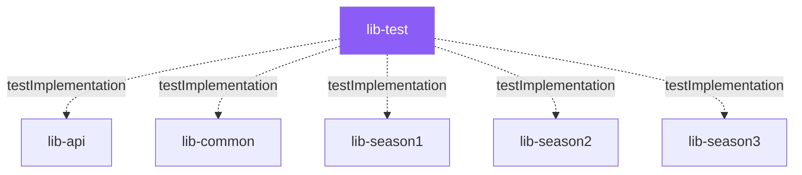

# Testing

## Test Module Architecture

Testing is centralized in the `lib-test` module, which is a **standalone Gradle module** that depends on all library
modules via `testImplementation`:



This design allows integration tests that span multiple modules (e.g., testing Season 3 deserialization + common
serialization) without creating circular dependencies.

### Test Dependencies

| Library        | Purpose                                    |
|----------------|--------------------------------------------|
| JUnit Jupiter  | Test framework                             |
| Mockito        | Mocking                                    |
| Jackson (YAML) | YAML serialization in tests                |
| Commons Codec  | Hex encoding/decoding for binary test data |

## Test Structure

```
lib-test/src/test/java/org/sehkah/ddon/tools/extractor/lib/test/
├── api/
│   ├── crypto/          ← Blowfish, CRC, Zip utility tests
│   └── io/              ← BinaryReader/BinaryWriter tests
└── logic/
    ├── packet/
    │   └── deserialization/  ← Packet deserializer tests
    └── resource/
        ├── deserialization/
        │   ├── EncryptedArchiveDeserializerTest.java
        │   └── ReferenceArchiveDeserializerTest.java
        ├── serialization/
        │   ├── EnemyGroupSerializerTest.java
        │   ├── GUIMessageSerializerTest.java
        │   └── TextureSerializerTest.java
        ├── FrameworkResourcesUtilTest.java
        └── LayoutUtilTest.java
```

### Test Resources

```
lib-test/src/test/resources/       ← Binary test fixtures (.emg, .gmd, .arc, .tex, etc.)
```

## Test Categories

### Round-Trip Serialization Tests

These tests verify that **binary → Resource → JSON → Resource → binary** produces identical output:

| Test Class                 | Resource Type             | What It Tests                                                                                              |
|----------------------------|---------------------------|------------------------------------------------------------------------------------------------------------|
| `EnemyGroupSerializerTest` | `EnemyGroupList` (`.emg`) | Deserialize binary → serialize to binary → compare bytes                                                   |
| `GUIMessageSerializerTest` | `GUIMessageList` (`.gmd`) | Deserialize binary → serialize to binary → compare bytes. Tests both simple and complex GMD files.         |
| `TextureSerializerTest`    | `Texture` (`.tex`)        | Deserialize TEX → serialize TEX → compare bytes. Tests multiple TEX format variants (version 8349, 41117). |

**Typical pattern:**

```java
// 1. Create manager (Season 3, no meta info)
ClientResourceFileManager manager =
    new ClientResourceFileManagerSeason3(null, null, SerializationFormat.json, false);

// 2. Deserialize binary test fixture
BufferReader reader = new BinaryReader(testFixtureBytes);
Resource deserialized = manager.deserialize(testFilePath, reader);

// 3. Get the serializer
ClientResourceSerializer<Resource> serializer = manager.getSerializer(fileName, deserialized);

// 4. Serialize back to binary
byte[] reserialized = serializer.serializeResource(deserialized);

// 5. Assert byte-for-byte equality
assertArrayEquals(testFixtureBytes, reserialized);
```

### Archive Deserialization Tests

| Test Class                         | Archive Type       | What It Tests                                                                       |
|------------------------------------|--------------------|-------------------------------------------------------------------------------------|
| `ReferenceArchiveDeserializerTest` | ARCS (unencrypted) | Parses a reference archive, verifies resource count, paths, and decompressed sizes. |
| `EncryptedArchiveDeserializerTest` | ARCC (encrypted)   | Full pipeline: Blowfish decrypt → zlib decompress → verify resource integrity.      |

### API-Level Tests

| Test Directory | What It Tests                                                                                             |
|----------------|-----------------------------------------------------------------------------------------------------------|
| `api/crypto/`  | `BlowFishUtil`, `CrcUtil`, `ZipUtil` — unit tests for crypto primitives.                                  |
| `api/io/`      | `BinaryReader`, `BinaryWriter` — tests for reading/writing all primitive types, strings, vectors, arrays. |

### Utility Tests

| Test Class                   | What It Tests                                                                                                                                         |
|------------------------------|-------------------------------------------------------------------------------------------------------------------------------------------------------|
| `FrameworkResourcesUtilTest` | DTI.txt loading, resource name → extension mapping, JamCRC hash computation, `getFileExtension()` and `getFrameworkResourceClassNameByCrc()` lookups. |
| `LayoutUtilTest`             | Layout data parsing utilities.                                                                                                                        |

## JMH Benchmarks

Both `lib-api` and `cli` modules include JMH (Java Microbenchmark Harness) support:

```groovy
// lib-api/build.gradle
plugins {
    id 'me.champeau.jmh'
}

jmh {
    benchmarkMode = ['thrpt']
    iterations = 2
    fork = 1
    warmupIterations = 1
    resultFormat = 'CSV'
    jmhVersion = '1.37'
}
```

Benchmark source files are located in:

```
lib-api/src/jmh/java/org/sehkah/...
cli/src/jmh/java/org/sehkah/...
```

These can be run with:

```bash
./gradlew jmh
```

## Running Tests

```bash
# Run all tests across all modules
./gradlew test

# Run only lib-test module tests
./gradlew :lib-test:test

# Run a specific test class
./gradlew :lib-test:test --tests "*.EnemyGroupSerializerTest"

# Run with verbose output
./gradlew :lib-test:test --info
```

## Test Fixture Conventions

- **Binary fixtures** are stored as raw binary files in `src/test/resources/`.
- **Season 3** is the primary test target.
- Tests instantiate `ClientResourceFileManagerSeason3` with `null` for `clientRootFolder` and `clientTranslationFile` (
  meta-information is not tested in round-trip tests).
- `SerializationFormat.json` is used as the default format in tests.
